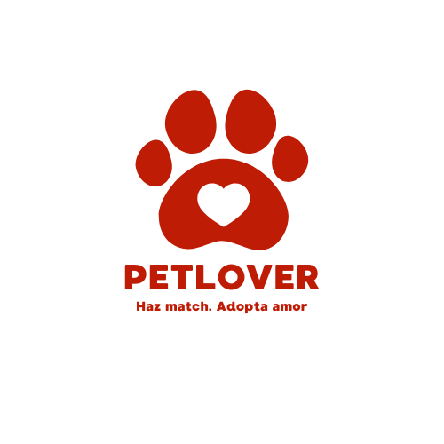

# PetLover



Proyecto de aplicación de adopción de mascotas que fue desarrollado para el curso **Desarrollo de Aplicaciones** de Coderhouse.

Esta aplicación está construida con **Expo SDK 53** y utiliza las siguientes tecnologías y librerías:

- **React Navigation** para la optima navegación entre las pantallas (screens) de la aplicación.
- **Expo SQLite** que permite crear una base de datos para la persistencia de las sesiones del usuario.
- **Componentes personalizados** (`custom components`) como el header.
- **Redux Toolkit (RTK) y RTK Query** que nos permite gestionar el estado global de nuestros componentes de la aplicación y que permite la comunicación con sus hooks entre esos componentes.
- **Firebase para Realtime Database y Autenticación** la cual nos permite acceder a gestionar/modificar/agregar datos como objetos (.json) y que nuestra aplicación pueda interactuar con esos datos, fuera de la persistencia del estado global.
- **Expo Camera**, la cual nos permite acceder a la camara de nuestro dispositivo para que el usuario pueda realizar acciones propias de él, como, cambiar su foto de perfil. (También interactua con Firebase y de manera persistente en el estado global.)

---

## Requisitos previos

Antes de instalar y ejecutar la app, se debe tener instalado los siguientes programas y/o librerías:

- [Node.js](https://nodejs.org/) (versión 20 o superior recomendada)
- [Expo CLI](https://docs.expo.dev/get-started/installation/) (global)
- [Git](https://git-scm.com/) para poder acceder al repositorio, clonar el proyecto y emularlo desde android studio.

---

## Instalación y configuración

1. Escribe los siguientes comandos para clonar el repositorio en la terminal que prefieras

git clone https://github.com/RodrigoArayaMunoz/PetLover.git
cd PetLover

2. Instala las dependencias:

npm install


3. Iniciá la aplicación en modo desarrollo y con el caché borrado:

```
npx expo start --clear
```
5. Abre la aplicación en un emulador o en un celular con Expo Go